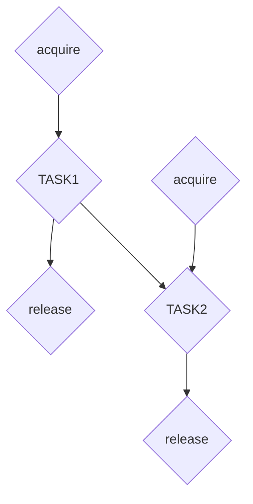

# Realm Reservation

## Introduction

In parallel programming, atomicity refers to the property of an indivisible and uninterruptible operation.
There are many primitives for guaranteeing atomicity, such as read/writer locks, 
semaphores, mutex, etc. However, they all block execution, which we always want to avoid.
We need a way to ensure that two or more parallel operations can 
guarantee atomicity without specifying ordering using event preconditions.

Realm provides `Reservation`, an atomicity primitive that operates in 
a deferred execution manner without blocking.
Reservations also work in distributed memory environments across processes.
In this tutorial, we will walk through an example of
using reservations. There are two types of tasks in the example:
`WRITER_TASK` updates the data of an instance, while
`READER_TASK` only reads the instance. Only one writer task can
hold ownership of the instance at a time, but multiple 
reader tasks can access the instance concurrently.

Here is a list of covered topics:

* [Creating Reservations](#creating-reservations)
* [Mutually Exclusive Access](#mutually-exclusive-access)
* [Shared Access](#shared-access)
* [Limitations](#limitations)

## Creating Reservations

We create a reservation to protect the shared region instance that is accessed
by both reader and writer tasks.
```c++
Reservation reservation = Reservation::create_reservation();
```

## Mutually Exclusive Access

In this example, we launch multiple writer tasks, each of which reads
the shared region instance and add its index id into the instance, as shown in the `writer_inner_task`.
We use the `acquire` and `release` methods to ensure exclusive write access to the shared region instance.
```c++
Event e1 = reservation.acquire(0 /* mode */, true /* exclusive */, start_event /* wait on */);
e = cpus[i % cpus.size()].spawn(WRITER_TASK1, &task_args, sizeof(WriterTaskArgs), e1);
reservation.release(e);
```
The execution of `acquire` is deferred until all preconditions are satisfied. 
The method returns an event that is used as the precondition
of the corresponding writer task. The reservation is then released after each writer task exits, allowing for the next writer to acquire the reservation.
These two methods ensure that one writer task can be executed at a time, 
thereby preventing conflicts among multiple writers.

As mentioned before, a reservation can be used as a global lock across processes.
In this example, when `TestConfig::distributed_reservation` is set to true, 
we try to use the reservation inside `writer_task2` as a global lock. 
Like `Event`, a reservation can be passed into local/remote tasks 
via task argument. Inside `writer_task2`, we can use the `acquire` 
and `release` methods to ensure that only one `writer_inner_task` is executed at a time.  

## Shared Access

After the writer tasks update the shared instance,
we launch multiple reader tasks to read data from the region instance, as shown in `reader_task`. 
Usually, it is not necessary to use a reservation to protect reader tasks
because all writer tasks have already been finished. However, to demonstrate the use of shared ownership 
of the reservation, we also launch a writer task concurrently with the reader tasks.
To acquire the shared ownership of the reservation, we can pass 
`mode=1, exclusive=false` to the acquire method.
```c++
Event e1 = reservation.acquire(1 /* mode */, false /* exclusive */, writer_event /* wait on */);
Event e2 = cpus[i % cpus.size()].spawn(READER_TASK, &task_args, sizeof(ReaderTaskArgs), e1);
reservation.release(e2);

``` 
It is worth mentioning that `mode=0` indicates exclusive ownership, 
so we need to set the mode to a different number to obtain shared ownership.

## Limitations

There are several limitations when using a reservation.

- Currently, Realm does not allow multiple nodes to hold a reservation 
simultaneously. Therefore, acquiring a reservation in shared mode on different nodes is impossible.
- If multiple reservations need to be acquired, they must be acquired in 
a specific order to avoid deadlock, similar to how normal locks are acquired.
- Realm is not obligated to grant reservations in any specific order. For example,
in the following code:

```c++
// Launch task 1
e1 = reservation.acquire();
e2 = proc.spawn(TASK1, e1);
reservation.release(e2);
// Launch task 2
e3 = reservation.acquire();
e4 = merge(e2, e3);
e5 = proc.spawn(TASK2, e4);
reservation.release(e5);
```
A corresponding sequence diagram is shown below:

It is possible for the reservation e3 to be granted before the reservation e1, 
resulting in a deadlock because the second task launch 
will not run until the first task launch is done. Instead, the second acquire can wait on e2 rather than in the copy, thus forcing a proper total order free of deadlocks.
