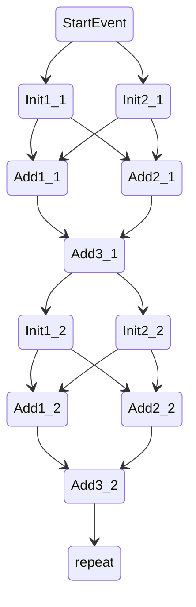
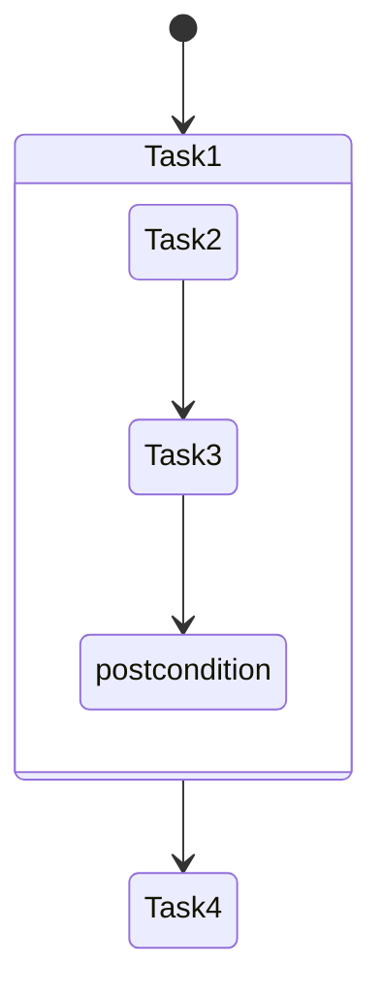

# Realm Subgraph

## Introduction

Realm has introduced a new feature called `Subgraph` to capture a group of Realm operations 
such that they can be re-executed efficiently. This tutorial will provide an example of 
constructing a Subgraph and compare it with the implementation without Subgraph.

Here is a list of covered topics:

* [Creating A Subgraph](#creating-a-subgraph)
* [Instantiating A Subgraph](#instantiating-a-subgraph)
* [Performance Comparison with Non-subgraph Implementation](#performance-comparison-with-non-subgraph-implementation)
* [Other Use Cases of Subgraph](#other-use-cases-of-subgraph)
* [Example](#example)

## Creating A Subgraph

In the upcoming example, we will examine a task graph consisting of repeated diamond-shaped subtask graphs. 
Each subtask graph contains five tasks: Init1, Init2, Add1, Add2, and Add3. Clients can use the `Subgraph` 
feature to represent these subtask graphs and avoid the need to construct them repeatedly.



1. To create a subgraph, the first step is to create a `SubgraphDefinition` object to describe the graph.
```c++
SubgraphDefinition sd;
```

2. The next step is to fill the `SubgraphDefinition` with operations. 
Five operations that are permitted within a subgraph: task spawn, copy/fill,
barrier arrival, subgraph instantiation, and reservation acquire/release. The creation of 
task spawners for the five tasks within the subgraph is demonstrated as follows:
```c++
// there are 5 tasks in the subgraph, so we pick the `tasks` entry and set its size to 5.
sd.tasks.resize(5);
// set the first task
sd.tasks[0].proc = p1;
sd.tasks[0].task_id = INIT_TASK;
sd.tasks[0].args.set(&init_args1, sizeof(InitTaskArgs));
  ...
```
The `proc` represents the processor where the task is launched.
The `task_id` specifies the task ID.
The `args` is used to pass arguments into the task. If we need to overwrite task arguments at later when instantiating a subgraph, 
we can use the `Interpolation` member of the `SubgraphDefinition`.
For other operations, please refer to the [subgraph header file](#subgraph-header-file).

3. Once operations within the subgraph have been defined, we need to specify the
dependencies between operations, which are also referred to as 
arrows in the task graph above (for example, Init1_1 depends on StartEvent). 
The following code illustrates how to specify the dependency for the first task in the subgraph:
```c++
// there are 9 dependencies in the subgraph, so we pick the `dependencies` entry and set its size to 9.
sd.dependencies.resize(9);
// set the dependency for the first task
sd.dependencies[0].src_op_kind = SubgraphDefinition::OPKIND_TASK;
sd.dependencies[0].src_op_index = 0;
sd.dependencies[0].tgt_op_kind = SubgraphDefinition::OPKIND_TASK;
sd.dependencies[0].tgt_op_index = 2;
```
The `src` and `tgt` represent the input and output of a dependency, respectively.
Additionally, `op_kind` is used to identify the type of operation, while `op_index` 
indicates the index location of the operation in `SubgraphDefinition.tasks`. 
Furthermore, `OPKIND_EXT_PRECOND` and `OPKIND_EXT_POSTCOND` refer
to the precondition and postcondition events of the subgraph. 

4. Once we have defined the operations and dependencies for the `SubgraphDefinition`, we can create a
`Subgraph` object using the `Subgraph::create_subgraph method`.
```c++
Subgraph sg;
Subgraph::create_subgraph(sg, sd, ProfilingRequestSet()).wait();
```

## Instantiating A Subgraph

The created subgraph can be instantiated and launched by calling
the `instantiate` method of the subgraph object. By passing the precondition and postcondition
events, we can concatenate multiple subgraphs into an entire task graph, as shown in the last section.

## Performance Comparison with Non-subgraph Implementation

In this example, we also implement the task graph shown in the 2nd section without using `Subgraph`, and 
compare its performance with the subgraph implementation. 

```
$ ./subgraph -ll:cpu 3 -ni 10000
[0 - 7fae4400f800]    0.396610 {3}{app}: Without subgraph, from constructing graph 362727.05 us, after constructing graph 213723.66 us
[0 - 7fae4400f800]    0.649626 {3}{app}: With subgraph, from creating subgraph 252666.81 us, from instantiating subgraph 252647.43 us, after instantiating subgraph 208799.71 us
```

It can be seen that after the graph is constructed or the subgraph is instantiated, the cost of executing
tasks is similar in both cases. However, using subgraph can significantly reduce the cost of constructing
the graph. Even though there is no significant improvement in running tasks, 
clients are still encouraged to use the subgraph when they see the pattern described in 
this example. When all Realm optimizations are finally in place, Subgraphs
should improve the task performance, and clients will not have to refactor the application code.

## Other Use Cases of Subgraph

The task graph below illustrates a situation where a nested task graph requires synchronization between tasks.
Specifically, Task 4 needs to wait until Task 2 and Task 3 within Task 1 are completed. However, the current
event API does not provide a way to describe post-conditional dependency between Task 3 and Task 4. 



Even if we implement the code as follows:
```
e1 = processor.spawn(Task1);
e2 = processor.spawn(Task4, e1);
```
It does not guarantee that the nested Task 2 and Task 3 are finished before launching Task 4.
One solution is to create a user evernt, use it as the pre-condition of Task 4, pass it into Task 3 
and trigger it before exiting the Task 3. 
Another solution is to define the Task 1 as a subgraph and use the `OPKIND_EXT_POSTCOND`
to describe the dependency between Task 3 and Task 4. 


## References

<div id="subgraph-header-file"></div>
[1]: [subgraph header file](https://github.com/StanfordLegion/legion/blob/stable/runtime/realm/subgraph.h)
